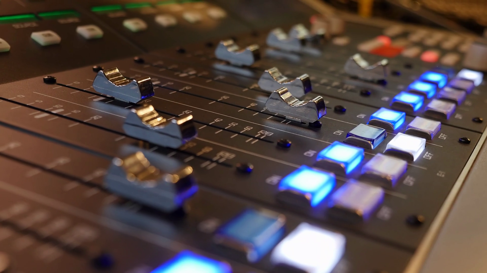
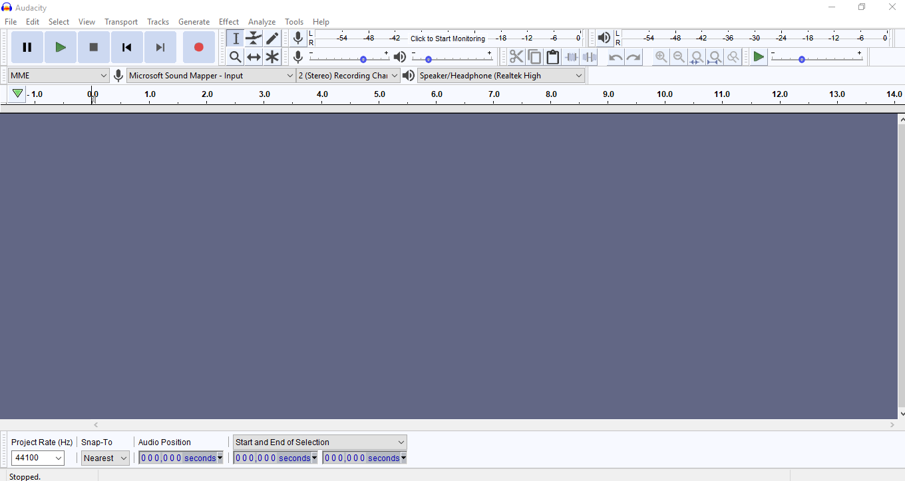
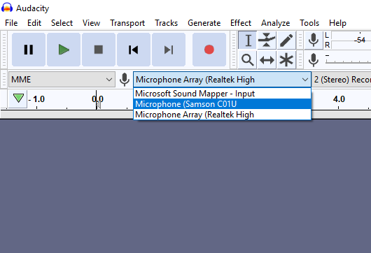
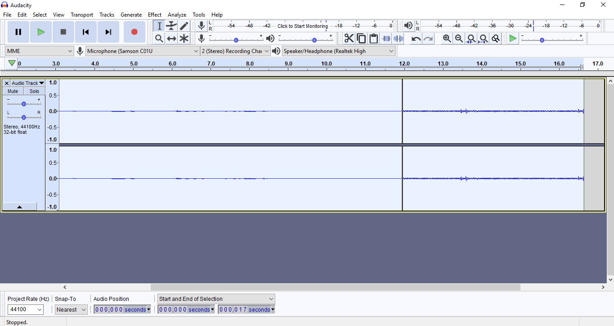

# Digital Audio in Audacity
## By Henry McMurray

#### The purpose of this tutorial is to walk students step by step, through the Digital Audion Module and give some extra insight on how a DAW works
#### The target would be any students who don't have experience working with a DAW like Audacity or Audition
---

## What is a DAW
* DAW stands for Digital Audio Workstation
* A DAW can be either a physical device like shown above or a program like Adobe Audition or Audacity
* DAWs are extremely useful for production and editing and are used in a variety of media anywhere from music and tv to sound effects

## Getting Started(and other useful info)
* For this project we are going to be using the free program Audacity
* First download audacity by going [here](https://www.audacityteam.org/) and downloading the program for whatever OS you are running
* Once it is downloaded and ready it should look something like this

* I suggest going to the bottom right corner and setting the "Project rate" to either 48000 or 44100
  * These frequencies are industry standards and you will most likely be requested to work with a company's preference of the two
  * These frequencies refer to the programs sample rate which is how often the program is sampling audio through a mic
  * A frequency of 48000 means the program is capturing audio 48000 times every second! So the lower the Hz the choppier it'll sound
* Next lets plug in a device to record audio(This can be a mic built in to you computer or even a guitar or keyboard!)

* To Start recording press the red dot button
  * Audacity will automatically make the first track for you when hitting the record button for the first times
  * if you want to make another track to layer sounds or record another person go to 'Tracks' and 'Add New'
  * in some programs like Adobe Audition the mic will need to be 'armed' to record by pressing a button next to the desired track but in Audacity all you need to do is click on the track
* Pressing the pause button will only pause the recording, when you're done or want to switch tracks you'll need to hit the Stop Square

*  Once you have Audio recorded it should look something like this, the sliders on the side of the track are for increasing Gain(Volume) and Pan(Left or right speaker)
* To export go to File>Export>Export as MP3

## The Assignment
Now that you know how to work the basics of Audacity have fun with it! Use the 'Effects' tab, changing Project rates, or try moving tracks around, make something you're happy with and turn in the mp3 when you're done

## Helpful Links
#### What is a DAW
[Link](https://www.youtube.com/watch?v=wt9MoJeMFZ8)
#### Working in audacity
[Link](https://www.youtube.com/watch?v=8ClwSNm362E)
